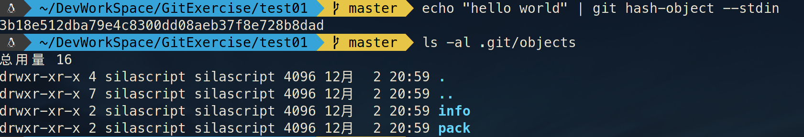

# Git 笔记

## Git 基本操作


### 基本配置

```shell
git config --global user.name "用户名"
git config --global user.email "邮箱"

```


### 基本流程操作


#### 提交大概流程

1. **初始化**:

```shell
git init
```


2. **向暂存区添加新修改**:

>```shell
>git add 要添加的文件
>```
>
>如果添加所有文件可使用:
>
>```shell
>git add .
>```


3. **提交到本地版本库**:

```shell
git commit -m "提交注释"
```


4. **提交到远程版本库**:

```shell
git push
```


#### 从远程获取数据


* **从远程版本库克隆到本地**:

```shell
git clone 地址 [本地版本库名称]
```

* **从远程版本库获取数据到本地**:

>```shell
>git fetch 地址
>```
>
>**fetch** 命令并不会自动合并或修改你当前的工作
>
>如果要自动合并远程数据到本地，应使用**pull**命令:
>
>```shell
>git pull
>```
>
>


### 辅助操作


查看版本当前状态:

```shell
git status
```


查看提交日志:

```shell
git log
```


查看当前分支:

```shell
git branch
```


查看暂存区:

```shell
git ls-files -s
```


查看远程版本库:

```shell
git remote show 远程版本库名称
```


## Git 底层命令

#### 基本概念

​	Git 的核心部分是一个简单的键值对数据库(key-value data store)。 你可以向该数据库插入任意类型的内容,它会返回一个键值,通过该键值
可以在任意时刻再次检索(retrieve)该内容。

#### 重要部件

* **objects**目录:	存储所有数据内容

* **refs**目录:		  存储指向数据(分支)的提交对象的指针

* **HEAD**文件: 	指示目前被检出的分支

* **index**文件:		保存暂存区信息


#### Git对象

###### 常用命令

​	**hash-object**

>**-w** 选项指示 **hash-object** 命令存储数据对象;若不指定此选项,则该命令仅返回对应的键值。 **-w** 后跟要生成hash值的源目标。
>
>**--stdin** 选项则指示该命令从标准输入读取内容;若不指定此选项,则须在命令尾部给出待存储文件的路径。 该命令输出
>一个长度为**40**个字符的校验和。 这是一个 SHA-1 哈希值——一个将待存储的数据外加一个头部信息
>(header)一起做 SHA-1 校验运算而得的校验和。

示例:

```shell
echo "hello world" | git hash-object --stdin
```

结果:


如果没有使用**-w** 选项，则在**objects**目录中不会生成相应的子目录.如下图:



而使用**-w** 选项后，则会在**objects**目录中生成相应的子目录及文件，其目录名为hash值最高**2**位，剩下**38**位为文件名，如下图:


又如：


​	**cat-file**

>**cat-file** 命令从 Git 那里取回数据。
>
>**-p** 选项可指示该命令自动判断内容的类型,并为我们显示格式友好的内容。
>
>前提是存在相应hash object。既**hash-object**命令执行时，使用了**-w**选项，即将生成的hash object对象存储进**objects**目录。
>
>如果hash object对象没找到则会报异常，如下图所示:
>
>
>
>**-t** 选项,可以让 Git 告诉我们其内部存储的任何对象类型


示例:

```shell
git cat-file -p 3b18e512dba79e4c8300dd08aeb37f8e728b8dad
```

结果:

	


#### 树对象


## GitHub使用

github访问慢可以使用重设host映射解决。

步骤:

1. 检测可用的ip

   >有两个常用网站可以检测
   >
   >- http://ping.chinaz.com
   >
   >  
   >
   >- https://www.ipaddress.com
   >
   >  

检测出的ip，最好自己**ping**一下，选速度比较快的几个。


2. 设置host文件

>在linux下host文件路径是/etc/hosts
>
>**修改host文件**，需要root权限
>
>host映射格式: **"ip 地址"**
>
>例子：
>
>```ini
>140.82.113.4 github.com
>```
>
>


需要重新设置host的地址:

>* github.com
>* gist.github.com
>* github.githubassets.com
>* raw.githubusercontent.com
>* camo.githubusercontent.com
>
>* avatars0.githubusercontent.com
>* avatars1.githubusercontent.com
>* avatars2.githubusercontent.com
>* avatars3.githubusercontent.com
>* user-images.githubusercontent.com
>* github-cloud.s3.amazonaws.com
>* assets-cdn.github.com

***.githubusercontent.com** 这几个地址跟图片相关,如果github能访问但图片加载慢或加载不出来，就得配这几个地址了！


