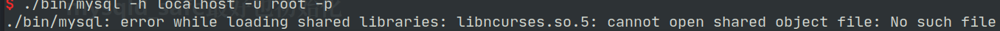
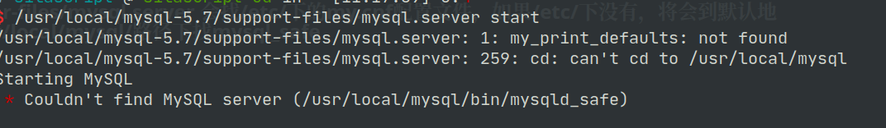

# Linux下安装MySQL5.7


### 创建用户组及用户
```shell
groupadd mysql
useradd -r -g mysql -s /bin/false mysql
```


### 将压缩包解压到要安装的目录
```shell
cd /usr/local
tar zxvf /path/to/mysql-VERSION-OS.tar.gz
ln -s full-path-to-mysql-VERSION-OS mysql
```


#### 在mysql安装目录下新建mysql-files目录并分配权限

```shell
mkdir mysql-files
chmod 750 mysql-files
```

> **data**目录不能提前建，它是由**mysqld** 初始化时通过**--datadir**来指定生成的


### 初始化：
``` shell
./bin/mysqld --initialize --user=mysql --basedir=/usr/local/mysql-5.7/ --datadir=/usr/local/mysql-5.7/data/ --pid-file=/usr/local/mysql-5.7/data/mysql.pid
```

> **--datadir**选项是必需的，并且数据目录必须不存在。
>
> 用**--initialize**会给root生成一个默认密码，**--initialize-insecure**不生成密码

**--user** **--basedir** **--datadir** **--pid-file** 本来这几个选项是**mysql_install_db**的。


> 从 MySQL 5.7.6 开始不推荐使用**mysql_install_db**，因为它的功能已集成到 MySQL 服务器**mysqld**中。要初始化 MySQL 安装，请使用**--initialize**或**--initialize-insecure**选项调用**mysqld**。


#### **mysqld**的选项:

```shell

--initialize        	Create the default database and exit. Create a super user 
						with a random expired password and store it into the log.
						
--initialize-insecure 	Create the default database and exit. Create a super user with empty password.
                    
-u, --user=name     	Run mysqld daemon as user.
    
-b, --basedir=name  	Path to installation directory. All paths are usually resolved relative to this
  
-h, --datadir=name  	Path to the database root directory
  
--pid-file=name     	Pid file used by safe_mysqld


```

使用**mysqld --verbose --help** 查询**mysqld**的选项和参数，发现原来**mysql_install_db**中的选项，在**mysqld**中都存在了，这也印证了"**mysql_install_db**将在将来的 MySQL 版本中删除"的说法。


默认情况,执行**mysqld** 可能缺少**libnuma**库,安装**numactl**就可以解决这个问题：

```shell
sudo pacman -S numactl
```


>**data**、**mysql-files**目录的用户必须是**mysql**
>
>所以在将**mysql安装目录**改回root或其他用户后，单独再次修改**data**和**mysql-files**目录的用户为**mysql**

```shell
chown mysql data mysql-files
```

###### 开启ssl

```shell
bin/mysql_ssl_rsa_setup --datadir=/usr/local/mysql-5.7/data
```


### 启动：


 #### 启动方式1: mysqld_safe         

```shell
bin/mysqld_safe --user=mysql &
```

如果使用mysqld_safe方式登录，出现错误，往往是少了依赖。



那就装依赖包：

```shell
sudo apt install libncurses5
```

> 缺少libncurses.so.5，在arch里是ncurses5-compat-libs，同样进行安装：

```shell
sudo pacman -S ncurses5-compat-libs　
```

> 使用初始化生成的临时密码使用root登录


#### 启动方式2: 使用mysql.server来启动

```shell
support-files/mysql.server start
```

>```shell
>如果启动出现以下错误:
>error while loading shared libraries: libncurses.so.5: cannot open shared object file: No such file or directory
>```
>
>明显就是缺少相应的库了。
>
>缺少**libncurses.so.5**，在arch里是**ncurses5-compat-libs**，同样进行安装：
>
>```shell
>sudo pacman -S ncurses5-compat-libs
>```


###### 为了方便将mysql.server添加为启动服务

```shell
cp support-files/mysql.server /etc/init.d/mysql.server
```

###### suppor-files/mysql.server 会找/etc/下的my.cnf配置文件，如果/etc/下没有，将会到默认地址/usr/local/mysql/路径下找mysql_safe




> **添加服务后重启，不然容易出现找不到服务**
>
> 如果报PID文件找不到就得重新初始化mysql了~


#### my.cnf配置

```cnf
[mysqld]
basedir=/usr/local/mysql-5.7
datadir=/usr/local/mysql-5.7/data

port=3356

character-set-server=utf8
collation-server=utf8_general_ci

explicit_defaults_for_timestamp=true


log-error=/usr/local/mysql-5.7/data/mysqld.log
pid-file=/usr/local/mysql-5.7/data/mysql.pid


```

> **mysql_install_db**不创建默认的`my.cnf`文件
>
> 从 MySQL 5.7.18 开始，`my-default.cnf`不再包含在分发包中或由分发包安装


#### 各配置文件路径及优先级

|      File Name      |                    Purpose                    |
| :-----------------: | :-------------------------------------------: |
|     /etc/my.cnf     |                Global options                 |
|  /etc/mysql/my.cnf  |                Global options                 |
|  SYSCONFDIR/my.cnf  |                Global options                 |
| $MYSQL_HOME/my.cnf  |     Server-specific options(server only)      |
| defaults-extra-file |                                               |
|      ~/.my.cnf      |             User-specific options             |
|   ~/.mylogin.cnf    | User-specific login path options(client only) |

> MySQL实例启动需要依赖**my.cnf**配置文件，而配置文件可以存在于多个操作系统目录下。
>
> **my.cnf**的默认查找路径，从上往下找到的文件先读，但优先级逐级提升。

###### 


### 修改密码及权限

>使用初始化给的root帐号及随机密码登录mysql成功后，要修改密码

```mysql
alter user 'root'@'localhost' identified by 'youpassword'; 
```

###### 记得刷新下

```mysql
plush privileges;
```


###### 以下的修改密码不能在临时密码状态下使用，只能在上面修改后重新登录后才能使用

```mysql
grant all privileges on *.* to 'energy_pf'@'192.168.2.65' identified by 'energy_pf' with grant option;
```

> **每次对用户权限修改、增加都得flush下**


##### 查看user表

>user表是放在mysql数据库中
>
>所以先选择库再查询表
>
>```shell
>use mysql;
>
>select user,host,authentication_string from user;
>
>```
>
>mysql5.7的user的密码是加密后放在**authentication_string**这个字段中。
>
>


#### Misc


```shell

----启动MySQL
mysqld --defaults-file=/etc/my.cnf &
mysqld_safe --defaults-file=/etc/my.cnf --user=mysql &
service mysql start
/etc/init.d/mysql start
mysqld_multi start #多实例

----关闭MySQL
mysqladmin -uroot -plhr -S /tmp/mysql3306.sock shutdown
service mysql stop
/etc/init.d/mysql stop
mysqld_multi stop #多实例

--杀死mysql
killall mysqld
killall -9 mysqld
```

如果原来使用mysqld_safe启动，可以使用**killall mysqld**关闭

> Unix 和类似 Unix 的系统上的 MySQL 发行版包含一个名为**mysql.server**的脚本，该脚本使用**mysqld_safe**启动 MySQL 服务器。它可以在使用 System V 样式的运行目录来启动和停止系统服务的系统(例如 Linux 和 Solaris)上使用。
>
> **mysql.server**是在 MySQL 源代码树中使用的脚本名称。安装的名称可能不同(例如**mysqld**或**mysql**)。

使用**mysql.server**启动和停止mysql

```shell
mysql.server start
mysql.server stop
```


