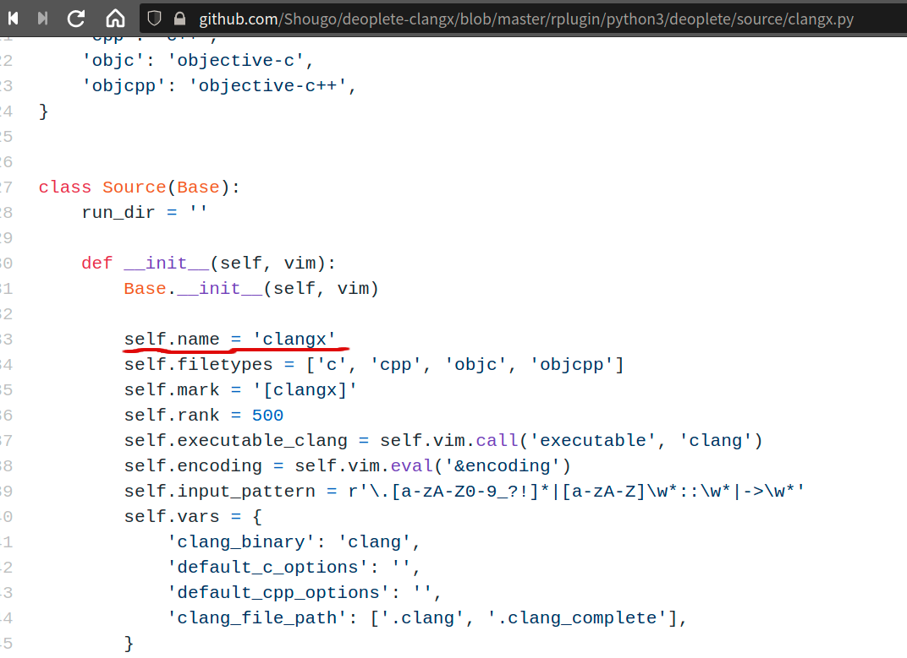
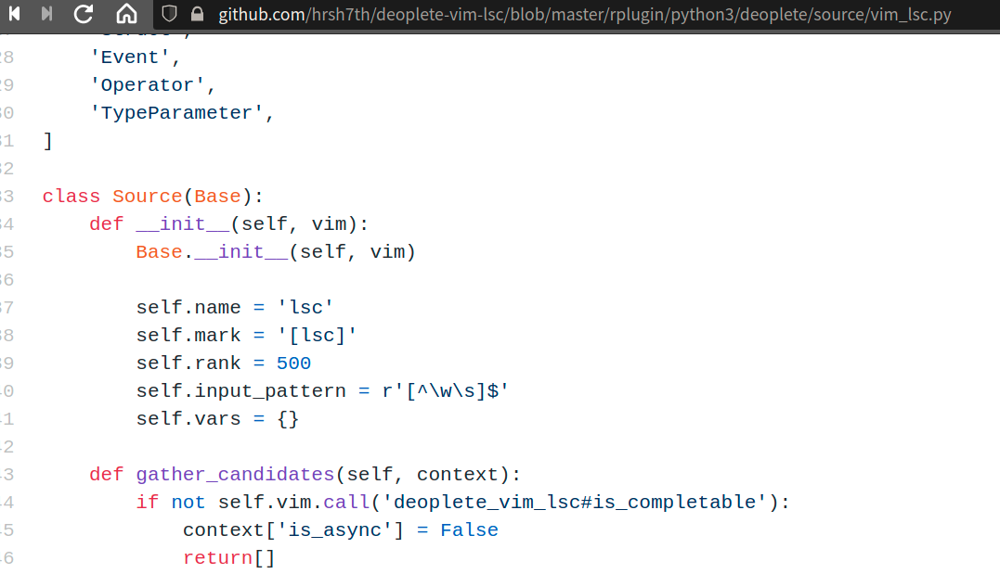

# LSP及补全相关

* [关于LSP](#about_lsp)

* [Vim LSP Client插件](#vp_lsp_client)
	* [vim-lsc](#vp_vim-lsc)
	* [vim-lsp](#vp_vim-lsp)
	* [LanguageClient-neovim](#vp_lcn)

* [Vim 补全插件](#vp_complete)
	* [neocomplete](#vp_complete_neocomplete)
	* [deoplete](#vp_complete_deoplete)
		* [使用vim-lsc为LSC](#vp_deoplete_lsc)
		* [使用vim-lsp为LSC](#vp_deoplete_lsp)
		* [使用LanguageClient](#vp_deoplete_lcn)
	* [Completor](#vp_complete_completor)
	* [ncm/ncm2](#vp_complete_ncm)
	* [asyncomplete](#vp_complete_asyncomplete)
	* [coc](#vp_complete_coc)

## <span id="about_lsp">关于LSP</span>
官方定义:
>The Language Server Protocol (LSP) defines the protocol used between an editor or IDE and a language server that provides language features like auto complete, go to definition, find all references etc.

一种用于为编辑器或IDE提供，诸如自动补全、定义跳转、查找关联等语言功能的编程语言服务协议。

LSP相关网站:
* [LSP规范](!https://microsoft.github.io/language-server-protocol/specifications/specification-current/)
* [LSP官网](!https://microsoft.github.io/language-server-protocol/)
* [各家LSP实现列表](!https://microsoft.github.io/language-server-protocol/implementors/servers/)

常用语言LSP：

* C/C++
clangd
clangd是clang的扩展工具(clang-tools-extra)
新版本是在LLVM中,安装LLVM就有clangd了。
安装完可以执行以下命令，如果能出现版本信息就证明clangd能用了！
```sh
	clangd --version
```

* Python


---

## <span id="vp_lsp_client">vim LSP Client插件</span>

LSP Language Server Protocol 为语言提供语言服务，有Server肯定就要有Client。
vim也需要一个Client去与LSP“对接”。这就是LSC--Language Server Client。
vim本身没有提供LSC(据说未来版本会逐步增加这块),所以得通过插件来实现。

LSC只是提供与LSP对接，并将LSP传来的语言服务获取补全数据。
而补全数据需要“展示”出来，如果不装补全插件，那这些数据是传给vim，使用vim本身的补全来将数据“展示”。

常用LSC插件

### <span id="vp_vim-lsc">vim-lsc</span>

```vim
	" 开启lsc	
	let g:lsc_enable_autocomplete  = v:true
	" 
	set completeopt=menu,menuone,noinsert,noselect

```

配置LSP,为各语言指定使用LSP。
如下示例:c和c++用的是clangd，python用的是pyls(python-language-server)。

```vim
	let g:lsc_server_commands = {
	 \ 'c': {
	 \    'command': 'clangd --background-index',
	 \	  'suppress_stderr': v:true
	 \	},
	 \ 'cpp':{
	 \	'command':'clangd --background-index',
	 \  'suppress_stderr': v:true
	 \ },
	 \ 'python':{
	 \  'command':'pyls'
	 \ },
	 \ rust':{
     \  'command':'rls'
     \ }
	 \}	

```
**command**指定是LSP名称,就是在终端中能调出LSP那个名称。

---

### <span id="vp_vim-lsp">vim-lsp</span>
[vim-lsp](https://github.com/prabirshrestha/vim-lsp)


```vim
	
	" 关闭lsp的语法诊断
	let g:lsp_diagnostics_enabled = 0

	" 设置各语言LSP
	if executable('clangd')
		au User lsp_setup call lsp#register_server({
			\ 'name': 'clangd',
			\ 'cmd': {server_info->['clangd', '-background-index']},
			\ 'whitelist': ['c', 'cpp', 'objc', 'objcpp'],
		\ })
	endif
	
	if (executable('pyls'))
		au User lsp_setup call lsp#register_server({
		\ 'name': 'lsp-pyls',
		\ 'cmd': {server_info->['pyls']},
		\ 'allowlist': ['python']
		\ })
	endif

```


---

### <span id="vp_lcn">LanguageClient-neovim</span>

[LanguageClient-neovim](https://github.com/autozimu/LanguageClient-neovim)是用Rust语言写的一个LSC插件。
这个LSC可以为[deoplete](#vp_complete_deoplete)及[ncm2](#vp_complete_ncm)补全框架提供补全数据源。
LanguageClient为补全框架提供源的名称是**LanguageClient**。

安装:
```Vim
	Plug 'autozimu/LanguageClient-neovim', {
	\ 'branch': 'next',
	\ 'do': 'bash install.sh',
	\ }
	
```

配置:
```vim
	" 为各语言指定LSP	
	let g:LanguageClient_serverCommands = {
	\ 'c':['clangd'],
	\ 'cpp':['clangd'],
	\ 'rust': ['rls'],
	\ 'python': ['pyls'],
	\ 'ruby': ['solargraph', 'stdio'],
	\ }


```

---

## <span id="vp_complete">Vim 补全插件</span>


### <span id="vp_complete_neocomplete">neocomplete.vim<span> 

[neocomplete](https://github.com/Shougo/neocomplete.vim)

neocomplete 不兼容vim8.2。而已没再来更新新功能，只有修bug。

这插件必须是vim7.3.855以上 vim8以下的版本，而且是拥有lua特性的版本使用。

这个插件现在基本可以忽略。


### <span id="vp_complete_deoplete">deoplete</span>
[deoplete](!https://github.com/Shougo/deoplete.nvim)

deoplete是[neocomplete](#vp_complete_neocomplete)的改进版，适配vim8+及neovim。

虽然叫补全框架，但实际框架需要与Language Server Client插件通信，拿到补全数据，才能将数据展示出来。
所以这就涉及到也LSC插件的配置。有的补全框架，自己给了部分语言的LSC实现，有的是通过支持第三方LSC插件来实现。deoplete既有自己的LSC，也支持多种LSC插件。

deoplete 安装:
deoplete安装有两个前置条件:
1. vim8或者neovim 而且是拥有python3特性
  在vim中用以下命令检测当前vim是否拥有python3特性
  ```vim
		:echo has("python3")
  ```
2. pynvim
 安装pynvim
 ```sh
	pip3 install pynvim
 ```
如果以上两个条件满足，就可以安装deoplete插件:
```vim
	if has('nvim')
	  Plug 'Shougo/deoplete.nvim', { 'do': ':UpdateRemotePlugins' }
	else
	  Plug 'Shougo/deoplete.nvim'
	  Plug 'roxma/nvim-yarp'
	  Plug 'roxma/vim-hug-neovim-rpc'
	endif
```
deoplete 配置:
```vim
	" 启动deoplete
	let g:deoplete#enable_at_startup = 1
	" 补全延迟，默认是20毫秒
	let g:auto_complete_delay=10


```
deoplete 快捷捷映射配置:
```vim
	" 补全菜单选择映射为用Tab键(默认是Ctrl-n和Ctrl-p)
	inoremap <expr> <Tab> pumvisible() ? "\<C-n>" : "\<Tab>"
	inoremap <expr> <S-Tab> pumvisible() ? "\<C-p>" : "\<S-Tab>"
	inoremap <expr> <cr> pumvisible() ? "\<C-y>" : "\<cr>"	

```
最关键一步到了，就是配置补全源。
补全源，大体有两个，一个来自snippet，另一个就是来自LSC接口/插件的。
Shougo大神为deoplete 提供了一些语言的LSC，比如c/c++的[clangx](https://github.com/Shougo/deoplete-clangx)。
这个“亲儿子”级的LSC,是与deoplete“配合”最好的LSC，基本不用怎么配置，开箱既用。
下面以clangx为例:
1. 安装clangd clangx插件是要调clangd，所以再使用这些LSC,得把**server**先装好。
2. 安装clangx插件
```
	PLug 'Shougo/deoplete-clangx'

```
3. 为deoplete配置补全源

deoplete也给出了source的支持列表:
[补全源](https://github.com/Shougo/deoplete.nvim/wiki/Completion-Sources)
那些deoplete开头的，都是“亲儿子”。

中括号中配的是LSC的名称，这名称哪里看得到，答案源码，如之前的clangx:


如果不用deoplete“推荐”的补全源，用其他补全源如vim-lsc或vim-lsp,就得为对deoplete指定补全源。

#### <span id="vp_deoplete_lsc">使用[vim-lsc](#vp_vim-lsc)为LSC</span>
要连接多语言LSC得通过再加个“管道”，即装个与这个LSC适配的“适配器”插件。
如“适配”deoplete与vim-lsc，就需要[deoplete-vim-lsc](https://github.com/hrsh7th/deoplete-vim-lsc)。

deoplete-vim-lsc的源码:

可以看到vim-lsc的名称是**lsc**,所以上面deoplete配补全源为什么用**lsc**
与clangx这种“亲儿子”的LSC不同，使用适配器适配的多语言LSC，在deoplete配置源时，得指定把LSC的name值--这是LSC唯一标识,通过这个名称的配置，补全框架deoplete就与这个LSC整合在一起了。

使用vim-lsc时，为deoplete配补全源:
```vim
	
	" lsc就是vim-lsc的唯一标识
	" min_pattern_length 是设置最少多少个字符触发补全菜单 
	" vim-lsc默认是2个字符触发补全
	call deoplete#custom#source('lsc',
            \ 'min_pattern_length',
            \ 1)

	" 为各语言指定LSC
	" 中括号中的lsc就是vim-lsc的唯一标识
	let g:deoplete#custom#option={
		\'sources': {
		\ '_': ['buffer'],
		\ 'c': ['lsc'],
		\ 'cpp': ['lsc'],
		\ 'python': ['lsc'],
		\ 'rust': ['lsc']
		\},
	\ }


```
而vim-lsc那里也需要配置:
[vim-lsc配置](#vp_vim-lsc)

#### <span id="vp_deoplete_lsp">使用[vim-lsp](#vp_vim-lsp)为LSC</span>
如果是deoplete使用的是vim-lsp，也是类似。需要装[vim-lsp](#vp_vim-lsp)和[deoplete-vim-lsp](https://github.com/lighttiger2505/deoplete-vim-lsp)
**vim-lsp**配置LSC，可查看以上章节: [vim-lsp](#vp_vim-lsp)

deoplete使用vim-lsp为补全源的配置如下：
```vim
	
	" 设置最少多少个字符触发补全菜单
	" vim-lsp 默认是2个字符
	call deoplete#custom#source('lsp',
            \ 'min_pattern_length',
            \ 1)

	let g:deoplete#custom#option={
		\'sources': {
		\ 'c': ['lsp'],
		\ 'cpp': ['lsp'],
		\ 'python': ['lsp'],
		\ 'rust': ['lsp'],
		\},
		\ 'smart_case': v:true
	\ }


```
跟[vim-lsc](#vp_vim-lsc)几乎一样，就是lsc的名称换成了**lsp**


#### <span id="vp_deoplete_lcn">使用[LanguageClient-neovim为LSC](#vp_lcn)为LSC</span>

LanguageClient作为deoplete的LSC跟使用[vim-lsc](#)与[vim-lsp](#)类似。
给deoplete的source 名称为**LanguageClient**。
配置如下：
```vim
	
	" 设置最少多少个字符触发补全
	" LanguageClient默认是1，就是这段代码不配就是一个字符就弹出初具一菜单
	" call deoplete#custom#source('LanguageClient',
	"        \ 'min_pattern_length',
	"        \ 2)

	let g:deoplete#custom#option={
		\'sources': {
		\ '_': ['buffer'],
		\ 'c': ['LanguageClient'],
		\ 'cpp': ['LanguageClient'],
		\ 'python': ['LanguageClient'],
		\ 'rugy': ['LanguageClient'],
		\ 'rust': ['LanguageClient']
		\}
	\ }


```

#### deoplete 相关插件

deoplete 提供的特定语言LSC插件:
* [deoplete-go](https://github.com/deoplete-plugins/deoplete-go)
* [deoplete-jedi](https://github.com/deoplete-plugins/deoplete-jedi)
* [deoplete-julia](https://github.com/JuliaEditorSupport/deoplete-julia)
* [deoplete-zsh](https://github.com/deoplete-plugins/deoplete-zsh)
* [neco-vim](https://github.com/Shougo/neco-vim)
* [deoplete-go](https://github.com/deoplete-plugins/deoplete-go)

deoplete 多语言LSC插件
* [deoplete-vim-lsp](https://github.com/lighttiger2505/deoplete-vim-lsp)
* [deoplete-vim-lsc](https://github.com/hrsh7th/deoplete-vim-lsc)
* [LanguageClient-neovim](https://github.com/autozimu/LanguageClient-neovim)
* []()
* []()

deoplete 其他“有趣”的补全源插件:
* [dictionary](https://github.com/deoplete-plugins/deoplete-dictionary)
* [deoplete-tag](https://github.com/deoplete-plugins/deoplete-tag)


---
### <span id="vp_complete_completor">Completor</span>
[Completor](https://github.com/maralla/completor.vim)是用Python写的异步补全框架。

安装:
```vim
	Plug 'maralla/completor.vim'
```


---
### <span id="vp_complete_ncm">ncm/ncm2</span>
[ncm2](https://github.com/ncm2/ncm2)

国人写的补全框架。

keymap映射极度恶心,垃圾！


### <span id="vp_complete_asyncomplete">asyncomplete</span>
[asyncomplete](https://github.com/prabirshrestha/asyncomplete.vim)

asyncomplete 这个补全框架是完全用vimscript写的，所以不需要像deoplete ncm2依赖python,coc依赖nodejs。
asyncomplete 这补全框架源可以用自己那堆针对某语言的LSC，也可以用如vim-lsp这样多语言的LSC。
多语言LSC插件，官方推荐是vim-lsp,为此官方还写了个“适配器”：[asyncomplete-lsp](https://github.com/prabirshrestha/asyncomplete-lsp.vim)。


### <span id="vp_complete_coc">coc </span>

