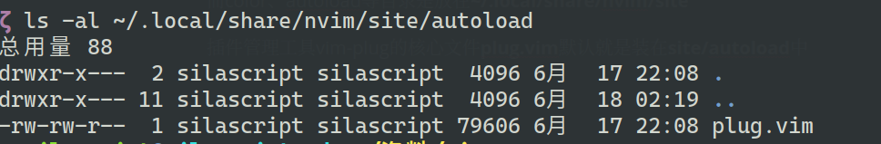

# NeoVim基本配置


默认当前用户配置文件及数据目录

以Ubuntu20.04为例

当前用户配置文件init.vim放在

**~/.config/nvim/**这个目录下(如果是windows,则是 **C:\Users\用户名\AppData\Local\nvim\目录下**)

而当前用户neovim的数据目录路径为:

**~/.local/share/nvim**

>windows下neovim的数据目录路径为**./AppData/Local/nvim-data/**

而color、autoload等目录是放在**~/.local/share/nvim/site**

插件管理工具vim-plug的核心文件**plug.vim**默认就是装在**site/autoload**中




## neovim默认设置


>- 'autoindent'    默认开启
>- 'autoread'      默认开启
>- 'backspace'     默认值为"indent,eol,start"
>- 'complete'      默认不包括 "i"
>- 'display'       默认值为"lastline"
>- 'encoding'      默认值为"utf-8"
>- 'formatoptions' 默认值为"tcqj"
>- 'history'       默认值为10000 (the maximum)
>- 'hlsearch'      默认开启
>- 'incsearch'     默认开启
>- 'langnoremap'   默认开启
>- 'laststatus'    默认值为2 (statusline is always shown)
>- 'listchars'     默认值为"tab:> ,trail:-,nbsp:+"
>- 'mouse'         默认值为"a"
>- 'nocompatible'  一直开启着
>- 'nrformats'     默认值为"bin,hex"
>- 'sessionoptions' 不包括 "options"
>- 'smarttab'      默认开启
>- 'tabpagemax'    默认值为50
>- 'tags'          默认值为"./tags;,tags"
>- 'ttyfast'       一直开启
>- 'viminfo'       包括 "!"
>- 'wildmenu'      默认开启
>
>


## 基础配置

```vim

" 开启真彩色
set termguicolors

set number
" 退格键设置
set backspace=indent,start


" 关闭各种自动生成文件
set noundofile
set nobackup
set noswapfile


" 与底部保持固定间距
set scrolloff=5

" 缩进
set shiftwidth=4
set tabstop=4
set softtabstop=4
" 不要将tab展开成空格
set noexpandtab

" 字符编码
set langmenu=zh_CN.UTF-8
set fileencodings=utf-8,gbk,gb18030,gb2312,ucs-bom,cp936,big5,euc-jp,euc-kr

" 语法高亮及文件类型
syntax on
filetype on
filetype plugin on


```


